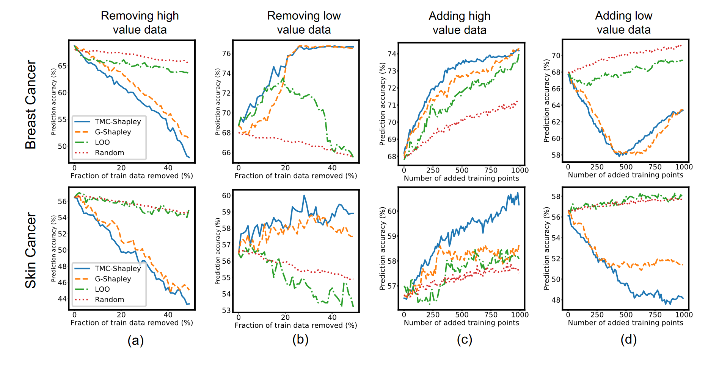

# Data-OOB (ICML '23)

<u>O</u>ut-<u>o</u>f-<u>b</u>ag Estimate as a Simple and Efficient Data Value

Yongchan Kwon (Columbia U) & James Zou (Stanford U)

2023.5.5&emsp;&emsp;&emsp;

<!--s-->

# Part.1 Background

<!--v-->

## Downstream tasks of valuation

Many Shapley-based data valuation methods have shown promising results in various downstream tasks. 

- Data Cleaning, i.e., recognize harmful/noisy/irrelevant data points;
- Data Selection or Summarization, e.g.,unbalanced scenario;
- Data Pricing not only rank [less work];
- ...

<!--v-->

## Shortage of existing work

- General Data Shapley requires training a significant number of models;
- KNN-Shapley only for unweighted $k$-NN models;
- Improving sample efficiency still need heavy computational costs (small dataset $\le 1000$);
- Validation dataset for utility function is not always available;
- Shapley axioms’ relevance to machine learning applications is unclear;
- ...

<!--s-->

# Part.2 OOB method

<!--v-->

## Jackknife-after-Bootstrap

**Bootstrap**: resampling on original samples with replacement

Using resampled statistics from the original data can approximate the relationship between the original sample statistics and population statistics

**Jackknife**: leave one out

Generates multiple leave-one-out estimates by repeatedly deleting one observation from the original data.

<!--v-->

## Framework

Why validation dataset is not necessary?

Predicting over the training data!

Each weak leaner is a decision tree and $T(y_1, y_2) = \mathbb{1}( y_1 = y_2 )$.

$\frac{1}{n} \sum_{i=1}^{n} \frac{\sum_{b=1}^{B} \mathbb{1}(w_{b i}=0) T(y_{i}, f_{b}(x_{i}))}{\sum_{b=1}^{B} \mathbb{1}(w_{b i}=0)}$

<!--s-->

# Part.3 Experiments

<!--v-->

## Efficiency: time cost

d = 10 and d = 100

<!--v-->

## Effectiveness: Remove low value data

<!--s-->

# Thanks

**Questions?**

